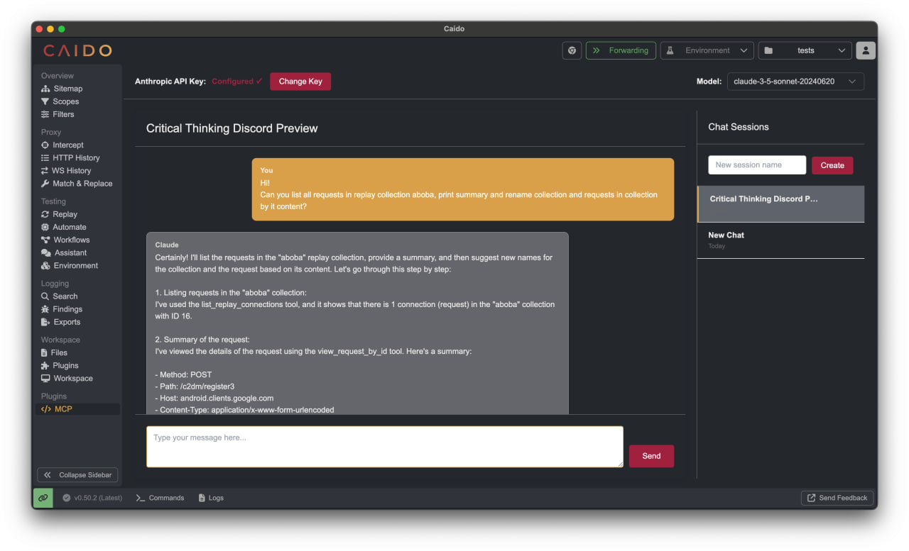

# (Ne)plox Caido AI Assistant

A powerful AI-powered assistant for Caido web application security testing, built with Claude AI.

## ⚠️ ATTENTION

**This is an early version of the assistant and may potentially damage your data or cause unexpected behavior. Use at your own risk and always backup your important data before testing.**

## Features

- **HTTPQL Query Search**: Search through requests using HTTPQL syntax for efficient filtering and analysis
- **Match/Replace Operations**: Perform sophisticated find and replace operations across requests and responses
- **Replay Sessions & Collections**: Execute and manage replay sessions and request collections for automated testing
- **Request Sending**: Send custom HTTP requests with full control over headers, body, and parameters
- **AI-Powered Analysis**: Leverage Claude AI for intelligent security testing insights and automation

## Prerequisites

- [Caido](https://caido.io/) web application security testing platform
- For Direct Usage: Claude API key from [Anthropic Console](https://console.anthropic.com/settings/keys)

## Getting Started

There are two ways to interact with the Caido AI Assistant:

### 1. Claude Desktop (Extension Required)

1. **Download the extension** for Claude Desktop
2. **Add to claude_desktop_config**:
   ```json
   {
     "mcpServers": {
       "caido": {
         "command": "node",
         "args": ["/path/to/claude-mcp-server/build/index.js"]
       }
     }
   }
   ```
3. **Click "Copy MCP Request"** in the Caido plugin tab
4. **Paste the request** in Claude to set the accessKey and API URL
5. **Congratulations!** You can now communicate with Caido through Claude


### 2. Direct API Access (Requires API Key)

1. **Enter your API KEY** in the plugin tab
2. **Use the functionality directly** from Caido without Claude Desktop



## (Ne)plox - Caido AI Assistant

The (Ne)plox AI assistant integrates seamlessly with Caido, providing AI-powered security testing capabilities through natural language commands and automated workflows.


